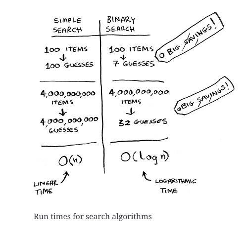
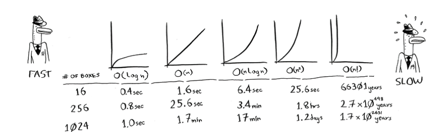

# Introduction to Algorithms

An algorithm is a set of instructions for accomplishing a task.

## Binary Search

`Binary search` is an algorithm; its input is a sorted list of elements. If the element you’re looking for is in that list, binary search returns the position where it’s located. Otherwise, binary search returns `null`.

Binary search works by checking the middle element of the list. If the middle element is greater than the element you’re looking for, then the algorithm will search the left half of the list. If the middle element is less than the element you’re looking for, then the algorithm will search the right half of the list. It will continue to halve the list until it finds the element or the list is empty.

On the other hand, a `simple search` is an algorithm that checks every element in the list, one by one. If you want to search for an element in a list of n elements, in the worst case, simple search will take n steps.

In general, for any list of n, binary search will take `log2 n` steps to run in the worst case, whereas simple search will take `n` steps.

Binary search implementation here: [binary_search.ts](binarySearch.ts)

When implementing a binary search, the maximum number of steps it will take to run is `log2 n`, where `n` is the number of elements in the list. This is really fast even for large lists.

## Big O Notation

Big O notation is special notation that tells you how fast an algorithm is. To calculate the Big O notation of an algorithm, we look at the number of operations the algorithm will make when the number of elements it has to search is very large (n -> infinite).

**Big O notation lets you compare the number of operations. Big O establishes a worst-case run time**

### Some common Big O run times

- `O(log n)`, also known as log time. Example: binary search.

- `O(n)`, also known as linear time. Example: simple search.

- `O(n * log n)`. Example: a fast sorting algorithm, like quicksort (coming up in chapter 4).

- `O(n2)`. Example: a slow sorting algorithm, like selection sort (coming up in chapter 2).

- `O(n!)`. Example: a really slow algorithm, like the traveling salesperson (coming up next!).

