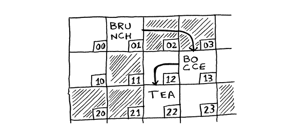

# Selection Sort

## Arrays

An `array` is a collection of items stored at contiguous memory locations. The idea is to store multiple items of the same type together. This makes it easier to calculate the position of each element by simply adding an offset to a base value, i.e., the memory location of the first element of the array (generally denoted by the name of the array).

It’s like going to a movie with your friends and finding a place to sit—but another friend joins you, and there’s no place for them. You have to move to a new spot where you all fit. In this case, you need to ask your computer for a different chunk of memory that can fit four tasks. Then you need to move all your tasks there.

## Linked Lists

A `linked list` is a linear data structure, in which the elements are not stored at contiguous memory locations. The elements in a linked list are linked using pointers. In a `linked list`, each element points to the next element. A `linked list` starts with a `head`, which points to the first element of the list. If the `linked list` is empty, then the `head` is a `null` reference. The elements of a linked list can be anywhere in memory, but they are linked together using pointers.

A linked list is like saying, “Let’s split up and watch the movie.” If there’s space in memory, you have space for your linked list.

Here we can find the run times for common operations on arrays and linked lists:

- Reading: O(1) for arrays, O(n) for linked lists
- Insertion: O(n) for arrays, O(1) for linked lists
- Deletion: O(n) for arrays, O(1) for linked lists
- Search: O(n) for arrays, O(n) for linked lists

Example Questions:

1. If we want to have a lot of inserts and a few reads, which data structure should we use? Answer: A linked list.
2. If we want to have a lot of reads and a few inserts, which data structure should we use? Answer: An array.
3. If we want to insert elements in the middle of the list, which data structure should we use? Answer: A linked list.
4. If we want to delete elements in the middle of the list, which data structure should we use? Answer: A linked list.
5. If we want to access elements randomly, which data structure should we use? Answer: An array.
6. Which DS is better for searching? Answer: An array.
7. Which DS is better for sorting? Answer: An array.
8. Which DS is better for random access? Answer: An array.
9. Which DS is better in terms of memory? Answer: A linked list but each item occupies more memory because of the pointers.
10. If we have to implement a queue for a restaurant, which DS should we use? Answer: A linked list.
