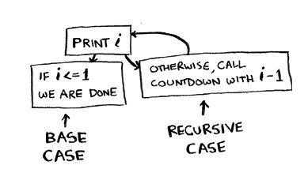
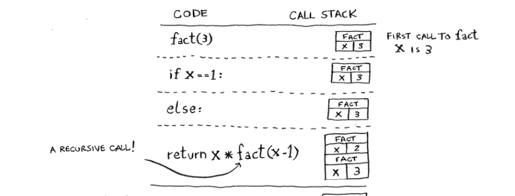

# Recursion

Recursion is when a function calls itself. It's a powerful technique that you can use to solve problems in elegant ways. There’s no performance benefit to using recursion; in fact, loops are sometimes better for performance. I like this quote by `Leigh Caldwell` on Stack Overflow

**Loops may achieve a performance gain for your program. Recursion may achieve a performance gain for your programmer. Choose which is more important in your situation!”**

Every recursive function has two cases: the base case and the recursive case. The base case is the condition that stops the recursion. The recursive case is the condition that continues the recursion.



## The Call Stack

The call stack is a stack data structure that stores information about the active subroutines of a computer program. When a function is called, a new stack frame is pushed onto the call stack. When a function returns, the stack frame is popped off the call stack. The call stack is a last-in, first-out (LIFO) data structure.

```python
def fact(x):
  if x == 1: # base case
    return 1
  else:
    return x * fact(x-1) # recursive case
```



Using the stack is convenient, but there’s a cost: saving all that info can take up a lot of memory. Each of those function calls takes up some memory, and when your stack is too tall, that means your computer is saving information for many function calls. At that point, you have two options:

You can rewrite your code to use a loop instead.

You can use something called tail recursion
