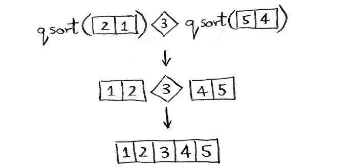

# Quicksort

Quicksort uses divide and conquer (D&C), a recursive technique. To use D&C, you need to follow three steps:

1. Figure out the base case. This should be the simplest possible case.
2. Divide or decrease the problem until it becomes the base case.
3. Combine or conquer the problem.

**Tip When you’re writing a recursive function involving an array, the base case is often an empty array or an array with one element. If you’re stuck, try that first.**

## Quicksort

Quicksort is a sorting algorithm. It’s faster than selection sort and insertion sort. It’s also faster than bubble sort and merge sort. Quicksort is a good example of the divide and conquer strategy.

We need to define the base case for quicksort. The base case is an array with zero or one element. An array with zero or one element is already sorted.

```python
def quicksort(array):
    if len(array) < 2:
        return array
```

We need to pick a `pivot`. The `pivot` is the item in the array that the rest of the items will be compared to. The goal is to split the array into two parts: one with items less than the pivot and one with items greater than the pivot.

```python
def quicksort(array):
    if len(array) < 2:
        return array
    else:
        pivot = array[0]
```

The process of splitting the array into two parts is called `partitioning`. We need to partition the array into two parts and then call `quicksort` recursively on each part.

```python
def quicksort(array):
  if len(array) < 2:
    return array
  else:
    pivot = array[0]

    less = [i for i in array[1:] if i <= pivot]
    greater = [i for i in array[1:] if i > pivot]

    return quicksort(less) + [pivot] + quicksort(greater)

print(quicksort([10, 5, 2, 3]))
```



Now you have:

- A sub-array of all the numbers less than the pivot
- The pivot
- A sub-array of all the numbers greater than the pivot

You can now combine the sub-arrays and the pivot.

TypeScript implementation here: [quicksort.ts](quicksort.ts)
