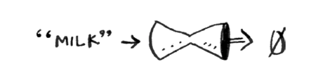
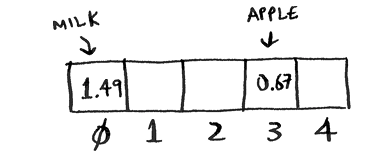
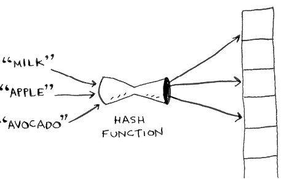
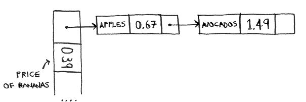
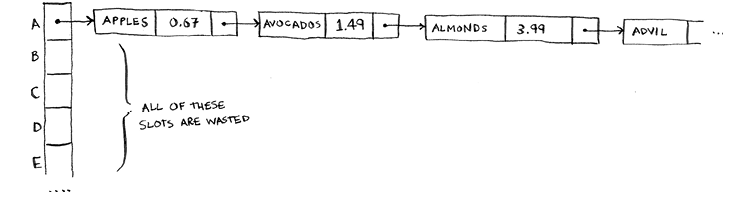

# Hash Tables

Hash tables are a type of data structure in which the address or the index value of the data element is generated from a hash function. That makes accessing the data faster as the index value behaves as a key for the data value. In other words, a hash table is used to store key-value pairs.

## Hash Functions

A hash function is any function that can be used to map data of arbitrary size to fixed-size values. The values returned by a hash function are called hash values, hash codes, digests, or simply hashes. Usually a `hash function` maps strings to numbers.


It needs to meet the following requirements:

1. It should be deterministic, meaning that the same input should always produce the same output.
2. It should generate a unique hash for different inputs.




An `array` plus a `hash function` is a `hash table`, where you can store data in an array and access it using a key in constant time `O(1)`.



```python
book = dict()
book["apple"] = 0.67
book["milk"] = 1.49
book["avocado"] = 1.49
print(book) # {'apple': 0.67, 'milk': 1.49, 'avocado': 1.49}
print(book["avocado"]) # 1.49
```

## Collisions

It's almost impossible to write a hash function that generates unique hash values for all inputs. When two different inputs produce the same hash value, it's called a `collision` (two keys assigned to the same index).

There are two common ways to handle collisions:

- `Chaining`: Each slot in the hash table stores a linked list of key-value pairs or an array of key-value pairs.
- `Open Addressing`: When a collision occurs, the program searches for the next open slot in the hash table.



The `hash function` is the most important part of a hash table. It needs to be fast and distribute keys uniformly across the hash table. Otherwise you could end up producing clusters of keys that slow down the hash table.


