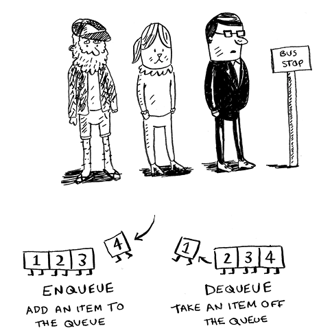

# Breadth First Search

`Breadth First Search` is the algorithm used to solve the problem of finding the shortest path in a graph. It is a graph traversal algorithm that starts traversing the graph from the root node and explores all the neighboring nodes. Then, it selects the nearest node and explores all the unexplored nodes. The algorithm follows the same process until it finds the goal node.

There are two steps to implement the `Breadth First Search` algorithm:

1. Model the problem as a graph
2. Implement the algorithm `bfs` to find the shortest path

## Introduction to Graphs

A `graph` models a set of connections. It consists of a set of nodes and a set of edges. The nodes are also called `vertices`. The edges connect the nodes. A graph can be directed or undirected. In a directed graph, the edges have a direction. In an undirected graph, the edges do not have a direction.


## Implementing the Breadth First Search Algorithm

`Breadth First Search` is useful to answer two types of questions:

1. Is there a path from node A to node B?
2. What is the shortest path from node A to node B?

**We need to keep the order of the nodes to explore in a queue.**

To implement the algorithm `bfs`, you need to follow these steps:

1. Create a queue to keep track of the nodes to explore
2. Create a set to keep track of the nodes you have already explored
3. Create a function `bfs` that takes the graph and the start node as arguments
4. Add the start node to the queue
5. While the queue is not empty, do the following:
   - Remove the first node from the queue
   - If the node has not been explored, explore it
   - Add the node to the set of explored nodes
   - Add the neighbors of the node to the queue



To implement a node with relationships we can use a dictionary in Python:

```python
graph = {}
graph["you"] = ["alice", "bob", "claire"]
graph["bob"] = ["anuj", "peggy"]
graph["alice"] = ["peggy"]
graph["claire"] = ["thom", "jonny"]
graph["anuj"] = []
graph["peggy"] = []
graph["thom"] = []
graph["jonny"] = []
```


```python
def search(name):
    search_queue = deque()
    search_queue += graph[name]
    searched = set()
    while search_queue:
        person = search_queue.popleft()
        if not person in searched:
            if person_is_seller(person):
                print(person + " is a mango seller!")
                return True
            else:
                search_queue += graph[person]
                searched.add(person)
    return False

search("you")
```


Check TypeScript implementation here: [Breadth First Search](./breadthFirstSearch.ts)
