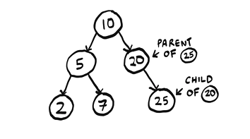
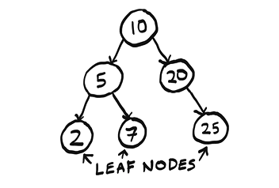
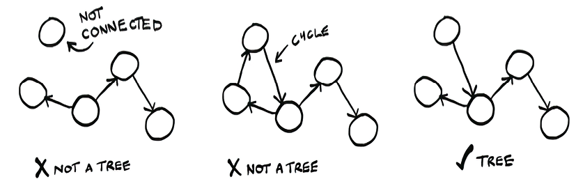
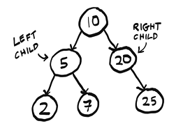

# Trees

Trees are a subset of graphs. Trees are made of `nodes` and `edges`. Each node can have multiple children, but only one parent. The top node is called the `root`, and nodes with no children are called `leaves`. Trees are often used to represent hierarchical data, such as file systems or organizational structures.




A file directory is a tree that all of us interact with every day.

`Breadth First Search (BFS)` is a way to traverse a tree or graph. It starts at the root and explores all the neighbors at the present depth before moving on to nodes at the next depth level. BFS uses a queue to keep track of nodes that need to be explored.

```python
from os import listdir
from os.path import isfile, join
from collections import deque

def printnames(start_dir):
    search_queue = deque()                     ①
    search_queue.append(start_dir)
    while search_queue:                        ②
        dir = search_queue.popleft()
        for file in sorted(listdir(dir)):      ③
            fullpath = join(dir, file)
            if isfile(fullpath):
                print(file)                    ④
            else:
                search_queue.append(fullpath)  ⑤

printnames("pics")
```

**Trees don't have cycles.** A tree is a special kind of graph that doesn't have cycles. This means that there is only one path between any two nodes in a tree. In other words, if you start at the root and follow the edges, you will never come back to the same node.

`Depth First Search (DFS)` is another way to traverse a tree or graph. It starts at the root and explores as far as possible along each branch before backtracking. DFS uses a stack to keep track of nodes that need to be explored.

```python
from os import listdir
from os.path import isfile, join

def printnames(dir):
    for file in sorted(listdir(dir)):  ①
        fullpath = join(dir, file)
        if isfile(fullpath):
            print(file)                ②
        else:
            printnames(fullpath)       ③

printnames("pics")
```

A tree is a connected, acyclic graph.



## Binary Trees

A `binary tree` is a special type of tree where nodes can have at most two children. The left child is less than the parent, and the right child is greater than the parent. This property makes binary trees useful for searching and sorting data. (An ancestry tree is an example of a binary tree since everyone has two biological parents)


