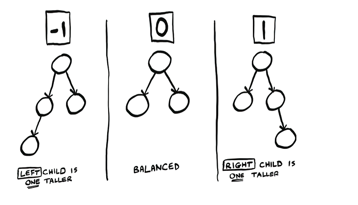

# Balanced Trees

To perform a binary search with arrays we need to keep the array sorted and, inserting new values in a sorted array is expensive.

To solve this problem we can use a `tree`, where we have a faster insertion and an acceptable search speed `(O(log n))`. To get this performance we need to implement a `Balanced Binary Search Tree (BST)`.

In a `BST`, is a binary tree with a special propery: the value of the left child is always smaller than the node, and the value of the right child is always greater. Not only that, all the numbers in the left child subtree are smaller than the node!

Based on this property we can perform a binary search by eliminating half of the tree in each cycle.

**_Height of the Tree: The Hight of the tree is the amount of nodes a tree has between the root and the fartest leaf. Shorter trees are faster for search._**

To get a short tree, we need to balance it.

## AVL Trees: A type of balanced tree

AVL trees are a type of self-balancing binary search tree. An AVL tree will give us that O(log n) height we want by balancing itself through `rotations`.

For the tree to know when it’s time to balance itself, it needs to store some extra information. Each node stores one of two pieces of information: its height or something called a balance factor. The balance factor can be −1, 0, or 1.

After an insert, you update the balance factors for that node’s ancestors. AVL trees require, at most, one rebalancing.
