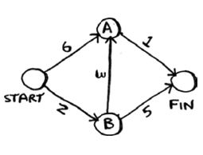
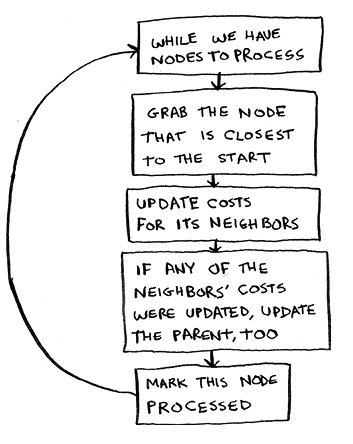

# Dijkstra's Algorithm

We can find the shortest path from A to B using BFS (breadth-first search) but, if we want to find the fastest path from A to B, we need to use Dijkstra's algorithm. In this case each segment has a weight, which is the time it takes to travel that segment. The algorithm will find the fastest path from A to B by taking into account the weights of each segment.

Steps for Dijkstra's algorithm:

1. Find the cheapest node. This is the node you can get to in the least amount of time.
2. Check whether there’s a cheaper path to the out-neighbors of this node. If so, update their costs.
3. Repeat until you’ve done this for every node in the graph.
4. Calculate the final path. (Coming up in the next section!)

Step 1: Find the node with the lowest weight.


Step 2: Calculate how long it takes to get to all of node B’s out-neighbors by following an edge from B.


Step 3: Repeat.

Step 4: Calculate the shortest path from A to B by following the nodes with the lowest weights.


To calculate the shortest path in an unweighted graph, use breadth-first search. To calculate the shortest path in a weighted graph, use Dijkstra’s algorithm

**_Dijkstra’s algorithm only works on weighted graphs with no cycles, where all the edges are nonnegative. Negative-weight edges break the algorithm._**

## Implementation



```python
graph = {}

graph["start"] = {}
graph["start"]["a"] = 6
graph["start"]["b"] = 2
# print(list(graph["start"].keys())), ["a", "b"]

graph["a"] = {}
graph["a"]["fin"] = 1

graph["b"] = {}
graph["b"]["a"] = 3
graph["b"]["fin"] = 5

graph["fin"] = {}

# Cost table
infinity = math.inf
costs = {}
costs["a"] = 6
costs["b"] = 2
costs["fin"] = infinity

# Parent table
parents = {}
parents["a"] = "start"
parents["b"] = "start"
parents["fin"] = None

processed = set()

node = find_lowest_cost_node(costs)
while node is not None:
    cost = costs[node]
    neighbors = graph[node]
    for n in neighbors.keys():
        new_cost = cost + neighbors[n]
        if costs[n] > new_cost:
            costs[n] = new_cost
            parents[n] = node
    processed.add(node)
    node = find_lowest_cost_node(costs)
```




```python
def find_lowest_cost_node(costs):
    lowest_cost = math.inf
    lowest_cost_node = None
    for node in costs:                                   ①
        cost = costs[node]
        if cost < lowest_cost and node not in processed: ②
            lowest_cost = cost                           ③
            lowest_cost_node = node
    return lowest_cost_node
```
