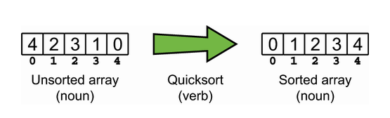
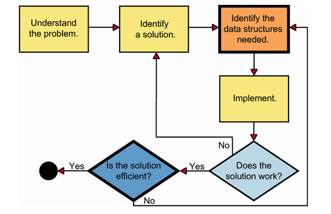

# Introducing Data Structures

## What are data structures?

A data structure is a way of organizing and storing data in a computer or a programming language. It defines the relationship between the data elements, the operations that can be performed, and the rules or constraints for accessing and modifying the data.

An algorithm on the other hand, is a step-by-step procedure to solve a problem. Algorithms are used to manipulate the data in these data structures.

Data structures provide the organization and representation of information (the data), and algorithms serve as instructions for transforming/interacting with that data

## How to solve a problem with data structures?

