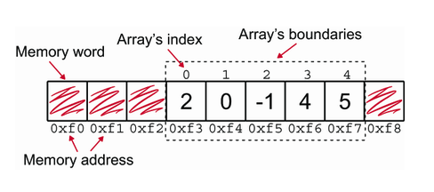

# Static Arrays

An array is a data structure that holds a collection of elements making them accessible by an index. The index is an integer that represents the position of an element in the array. The index starts at 0 and goes up to the length of the array minus one.
We use arrays when we need to store, iterate over, or manipulate a collection of elements of the same type, without knowing how the individual elements are correlated.

_An array is an indexed collection of data. We can't access an element in the array by its content, we need to use the index._

## Characteristics or Arrays as an Abstract Data Type

- It stores a collection of data.
- Its elements can be accessed by index not by value.
- Elements don’t have to be accessed sequentially; that is, if I need the 10th element of an array, I can access it directly without having to read the 9 elements stored in the array before it.

## Implementation of Arrays (static arrays)

- Arrays are allocated in memory as a single, uninterrupted block of memory with sequential locations, which is both memory and time efficient.

- Arrays are restricted to storing data of the same type. This restriction also stems from the need for optimization because it allows the same memory to be allocated for each element in the array and the compiler/interpreter to quickly know the memory address of each element. We’ll talk about this in detail in the next section.

- The size of arrays, that is, the number of elements contained in an array, must be decided when the array is created, and that size can’t be changed.



To create an array we can declare it or we can initialize it with values. Here is an example of how to declare an array in Python:

```python
# Declaring an array
arr = [None] * 5

# Initializing an array
arr = [1, 2, 3, 4, 5]
```

## Arrays in Python

In Python we have two options to create arrays, one of them is using `list` and the other is using the `array` module. The `array` module is a part of the Python standard library and it provides a way to create arrays of a fixed type but it's still a dynamically sized array, while `list` can contain elements of different types and can grow dynamically at the same time.

_The price of dynamic resizing is degraded performance and a slower data structure._

Python uses zero-based indexing for arrays, which means the first element in the array is at the index `0`, and the last element is at the index `n-1`, where `n` is the number of elements in the array.

## Operations on Arrays
