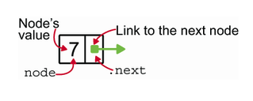
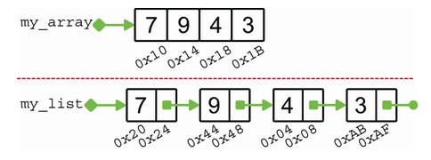
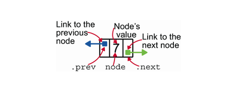
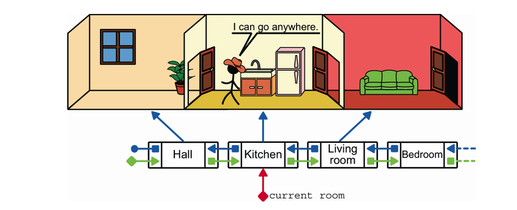
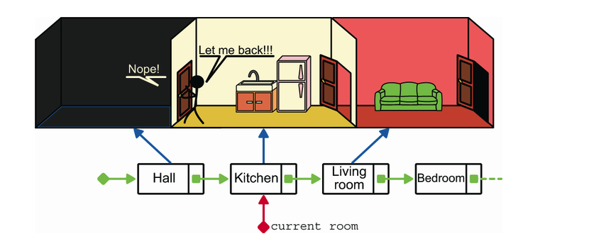

# Linked Lists

Unlike arrays, a linked list is a complex modular structure, made of building blocks called nodes: each node contains an element, a single value, of the linked list. But that’s not all! Because the nodes are not in contiguous areas of memory, each must also contain a link to the next node, an extra piece of data that stores the location in the memory of the next node in the list

A linked list is a collection of nodes where each node contains a value and a reference to the next node in the list. The first node is called the `head`, and the last node is called the `tail`. The `tail` node points to `None`, indicating the end of the list.

## Singly Linked Lists

A singly linked list is a linked list where each node only points to the next node in the list. The last node in the list points to `None`. The first node in the list is called the `head`, and the last node is called the `tail`.
I like to think of linked lists as two-tier data structures.
There is an external data structure that implements the linked list itself and provides an API for clients to interact with the list and perform our usual operations on it. This is like a shell, a wrapper around the linked list. But internally, inside this wrapper, we need to use a different data structure—the nodes that we have described earlier in the chapter. They can be thought of as data structures that store a single value (to be picky, two values: a user-facing value, the data stored by the client, and an internal value, the link to the next node).

See implmenetation of singly linked list in Python [here](singly-linked-list.py)

## Sorted Linked Lists

If we want to keep the list sorted, we can insert a new node in the correct position as we add it to the list. This way, we can avoid sorting the list every time we need to find an element or insert a new one. This is a good strategy if we need to keep the list sorted most of the time.

Having a sorted linked list offers no advantage over an unsorted linked list when searching for an element. The time complexity of searching for an element in a sorted linked list is O(n), the same as in an unsorted linked list. The only advantage of a sorted linked list is when we need to access the elements in order

## Doubly Linked Lists

A `Doubliy Linked List` is a linked list where each node points to the next node and the previous node in the list. The first node in the list is called the `head`, and the last node is called the `tail`. The `head` node's previous pointer points to `None`, and the `tail` node's next pointer points to `None`.

See implmenetation of singly linked list in Python [here](doubly-linked-list.py)

A doubly linked list can be applied in a game where we need to keep track of the player's location and the previous location. This way, we can easily move the player back to the previous location when needed.

That wouldn't be possible with a singly linked list because we would need to traverse the list from the beginning to find the previous location.

It is important to note that a doubly linked list requires more memory than a singly linked list because each node has two pointers instead of one. This is a trade-off between memory and performance, but sometimes it is necessary to use a doubly linked list to achieve the desired functionality.
