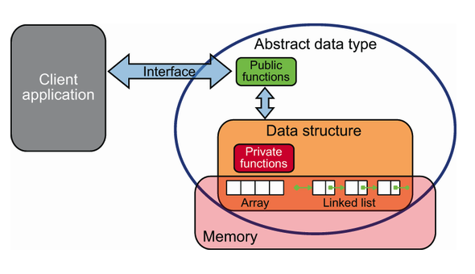

# Abstract Data Types

An `abstract data type` (ADT) focuses on what operations you can perform on the data, without specifying how those operations are implemented. A `data structure`, conversly, specifies more concretely how data is represented, as well as algorithms for performing operations on that data.

