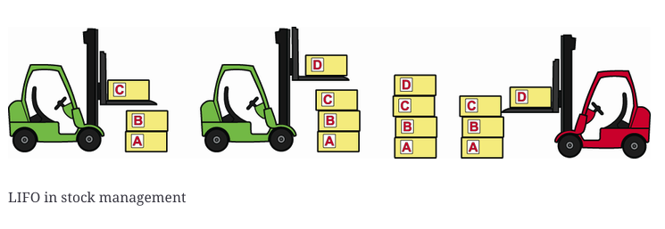
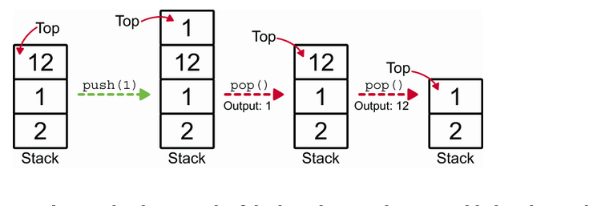

# Stacks

A `Stack` is a collection of items that are added and removed based on the principle of Last In First Out `(LIFO)`. A user may insert elements into a stack at any time, but may only access or remove the most recently added element that remains at the top of the stack.

To understand the concept of a stack, think of a stack of plates. You can add a plate to the top of the stack, and you can also remove a plate from the top of the stack. You can't remove a plate from the middle of the stack, and you can't add a plate to the bottom of the stack.

Accessing elements in a stack is `O(n)`s time complexity, where n is the number of elements in the stack. This is because you have to remove all the elements on top of the element you want to access.

## Implementing Stacks

To implement a stack we can use 3 options.

1. Static Array
2. Dynamic Array
3. Linked List

If we use a static array, we have to define the size of the stack at the beginning. If we use a dynamic array, we can resize the array when it's full. If we use a linked list, we can add and remove elements from the beginning of the list.
The problem with using arrays is that we have to resize the array when it's full, which is an `O(n)` operation.
Lists are better for implementing stacks because they can grow and shrink as needed and as we can access the first element in `O(1)` time complexity.

**Note**: In Python, we can use the `list` data structure to implement a stack if we know the maximum size of the stack. If we don't know the maximum size of the stack, we can use the `deque` data structure from the `collections` module.
