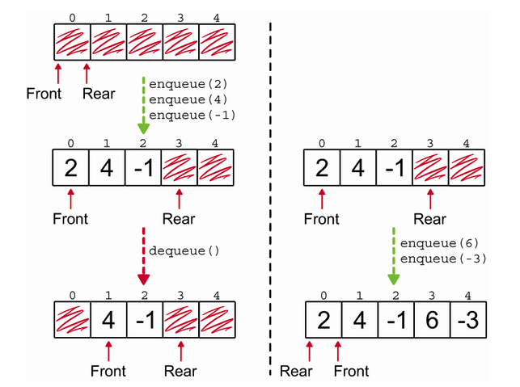

# Queues: Keeping information in the same order as it arrives

A Queue is a data structure that keeps information in the same order as it arrives. It's like a line at a grocery store: the first person to get in line is the first person to check out. While `stacks` use `LIFO` (Last In, First Out) ordering, queues use `FIFO` (First In, First Out) ordering.


In `queues` there is only one place elements can go when they are added to the queue, at the rear (or tail). When an element is removed from the queue, it can only come from the front (or head). This is why queues are sometimes called `First-In-First-Out` (FIFO) lists. To implement a `queue` we need to implement two methods: `enqueue` and `dequeue`.


For a `queue` we need to keep references to the front and rear of the queue. This allows us to add elements to the rear and remove elements from the front. We can use a `linked list` to implement a queue. We can add elements to the rear of the linked list and remove elements from the front.

We can implement a `queue` using a `single linked list`. We can add elements to the rear of the linked list and remove elements from the front. We can also use a `doubly linked list` to implement a queue.

Implementation with singly linked list here: [Queue - Singly](queue-singly-list.py)
Implementation with doubly linked list here: [Queue - Doubly](queue-doubly-list.py)

## Implementing Queues: Linked List vs. Array in Python

When implementing a queue, the choice between using a linked list (singly or doubly) and an array (list in Python) depends on performance trade-offs:

1.  Linked List (Singly or Doubly)
    Pros:

            Efficient O(1) enqueue (append at tail) and dequeue (pop from head).
            No need to shift elements when removing items from the front.
            Can grow dynamically without memory reallocation.

    Cons:

          Requires extra memory for pointers (especially for a doubly linked list).
          More complex implementation than arrays.
          Slower cache performance due to non-contiguous memory storage.

2.  Array (Python List)

    Pros:

          Simpler to implement and use.
          Fast random access (O(1)) since lists are indexed.
          Built-in Python lists allow dynamic resizing.

    Cons:

          Removing (pop(0)) from the front is O(n) since all elements need to shift left.
          If the array grows beyond its allocated memory, resizing takes O(n) time.

Python also offers a built-in `deque` class in the `collections` module that provides an optimized implementation of a double-ended queue. It is a hybrid data structure that combines the features of stacks and queues. The `deque` class is optimized for fast appends and pops from both ends.

```python
from collections import deque

queue = deque()
queue.append(1)    # Enqueue
queue.append(2)
print(queue.popleft())  # Dequeue, O(1)
```

## Implementing a Circular Queue

A `circular queue` is a variation of a queue that uses a fixed-size array to store elements. When the rear of the queue reaches the end of the array, it wraps around to the beginning. This allows the queue to reuse the empty slots at the front of the array.


