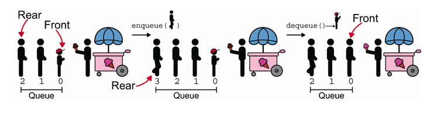
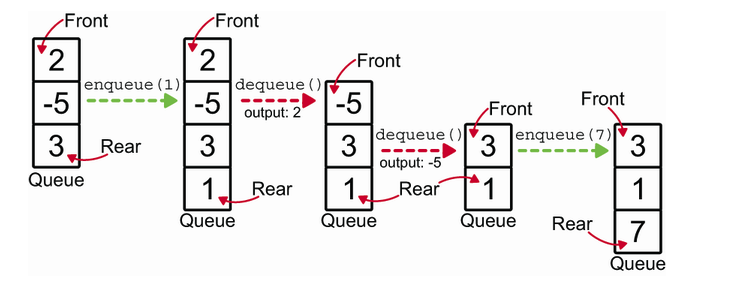

# Queues: Keeping information in the same order as it arrives

A Queue is a data structure that keeps information in the same order as it arrives. It's like a line at a grocery store: the first person to get in line is the first person to check out. While `stacks` use `LIFO` (Last In, First Out) ordering, queues use `FIFO` (First In, First Out) ordering.

In `queues` there is only one place elements can go when they are added to the queue, at the rear (or tail). When an element is removed from the queue, it can only come from the front (or head). This is why queues are sometimes called `First-In-First-Out` (FIFO) lists. To implement a `queue` we need to implement two methods: `enqueue` and `dequeue`.

For a `queue` we need to keep references to the front and rear of the queue. This allows us to add elements to the rear and remove elements from the front. We can use a `linked list` to implement a queue. We can add elements to the rear of the linked list and remove elements from the front.
