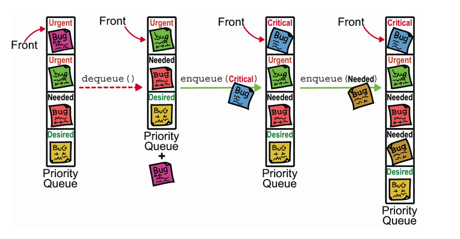
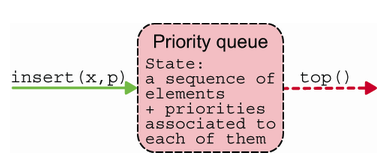
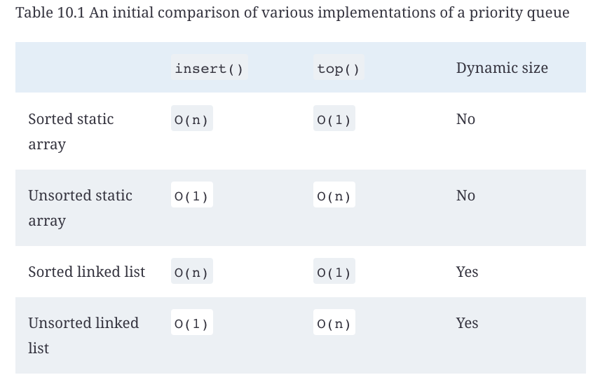
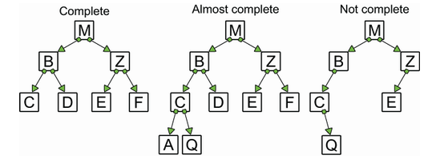
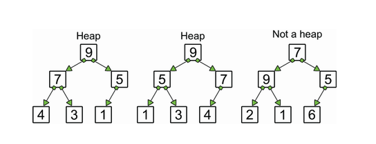
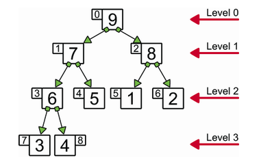
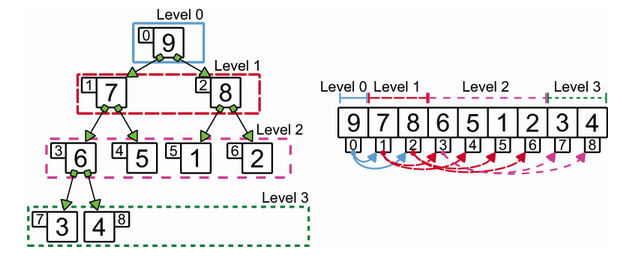

# Priority Queues and Heaps

A `priority queue` is a data structure that stores elements in a way that they can be retrieved in a sorted order. The elements are stored based on their priority. The element with the highest priority is retrieved first.

To implement a `priority queue` we need to implement two methods: `insert` and `extract_max` (or `top`).

The queue will always return the element with the highest priority. The priority can be defined based on the value of the element or based on some other criteria.

To implement a `priority queue` we have two options. We can keep the elements sorted by priority, or we can search for the element with the highest priority when we need to extract it. For that we can use an array or a linked list.

## Heap

A `heap` is a kind of tree. For a `priority queue`, we use a `binary heap`.
A `binary heap` must satisfy 3 properties:

1. Each node of the tree can have at most two children.
2. The tree should be almost complete. This means that all levels of the tree should be full, except for the last level. The last level should be filled from left to right. The tree is always left-justified.

3. The value of the parent node should be greater than or equal to the value of the child node. This is called the `heap property`.This last property guarantees that the element with the highest priority is always at the root of the heap

## Implementation

To implement a binary heap we can make use of some rules that allow us to create an index for each node in the tree. We can devise a rule: given a node with an index i > 0, its parent’s index is given by the integer division (i - 1) / 2, and its children have indexes `2 - i + 1` and `2 - i + 2`.

We can reorganize the elements of the tree linearly, placing each level side-by-side, the indexing we assign to the nodes will perfectly match the indexing of an array with the same elements.

We can use an array to represent a binary heap. The root of the tree will be at index 0, and the children of the node at index i will be at indexes `(2 * i )+ 1` and `(2 * i) + 2`.

With this implementation we can have efficient insertion and removal operations in `O(log n)` time complexity.

Implementation of a binary heap in Python here: [heap.py](heap.py)
