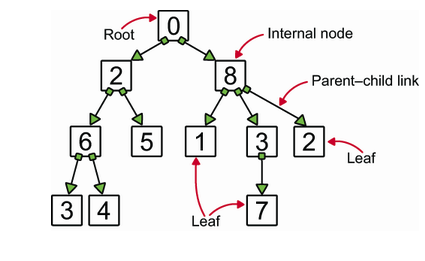
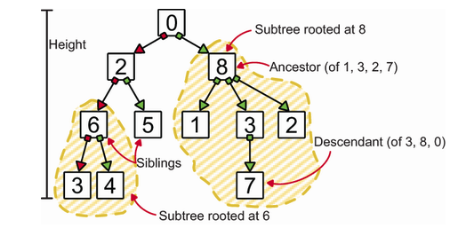
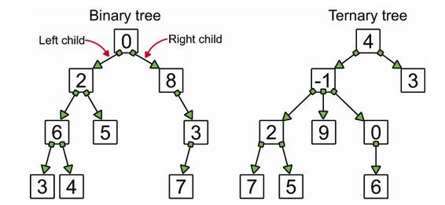
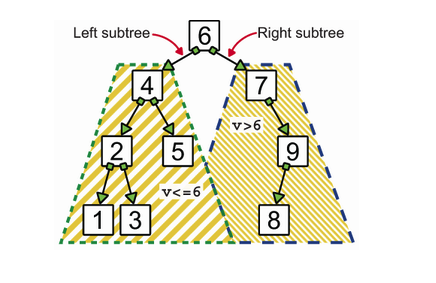

# Trees

A `tree` is a data structure that consists of nodes connected by edges or links. A tree has a root node and every node in the tree is connected by edges. The edges are directed from the parent node to the child node.

The type of tree is given by the maximum number of children a node can have. For example, a tree where each node can have at most two children is called a `binary tree`.

We have different types of `nodes` in a `tree`. The `root node` is the topmost node in the tree. The `parent node` is a node that has one or more child nodes. The `child node` is a node that has a parent node. The `leaf node` is a node that does not have any child nodes. The `height` of a tree is the length of the longest path from the root node to a leaf node. The `depth` of a node is the length of the path from the root node to that node. All children of the same node are `siblings`. There is no a direct link between siblings.

**_There shouldn't be any cycles or loops in a tree._**

## Binary Trees

Binary trees are defined by restricting each node to a maximum of two children. Thus, in a binary tree, a node may have zero, one, or two child links.

## Binary Search Trees

A binary search tree is a binary tree in which every node fits a specific ordering property. All left descendants of a node must be less than the node, and all right descendants must be greater.

**_All BSTs abide by the BST property: for any node N that stores a value v, all nodes in the left subtree of N will have values less than or equal to v, and all nodes in the right subtree of N will have values greater than v._**

Implementations of the binary tree[here](binary-search-tree.py).

## Tree Traversal

Tree traversal is the process of visiting each node in a tree exactly once. There are three ways to traverse a tree:

1. **Pre-order traversal**: In this traversal, we visit the root node first, then the left subtree, and finally the right subtree.
2. **Post-order traversal**: In this traversal, we visit the left subtree, then the right subtree, and finally the root node.
3. **In-order traversal**: In this traversal, we visit the left subtree, then the root, and finally the right subtree. This traversal is used to get the nodes in non-decreasing order.
