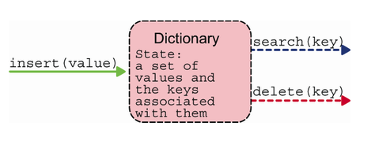
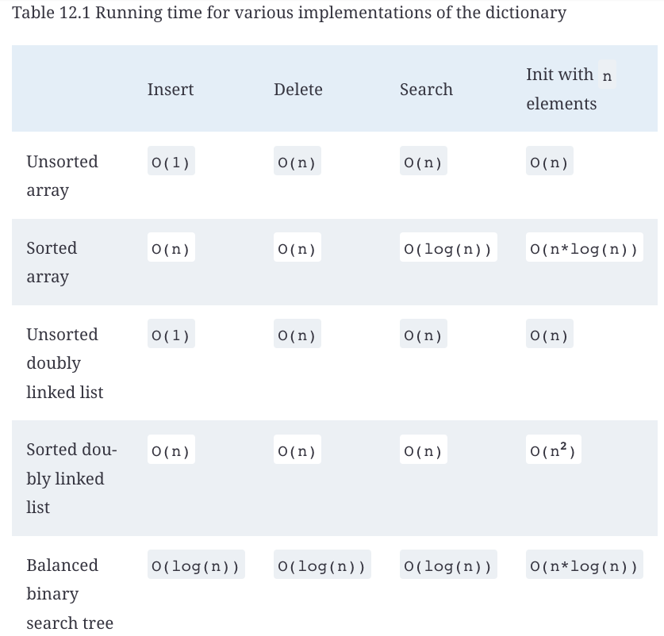
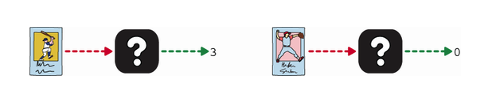
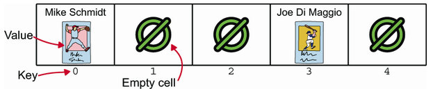
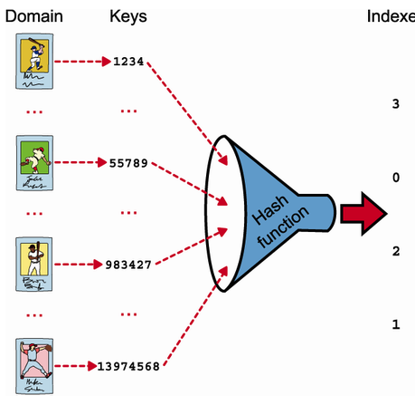
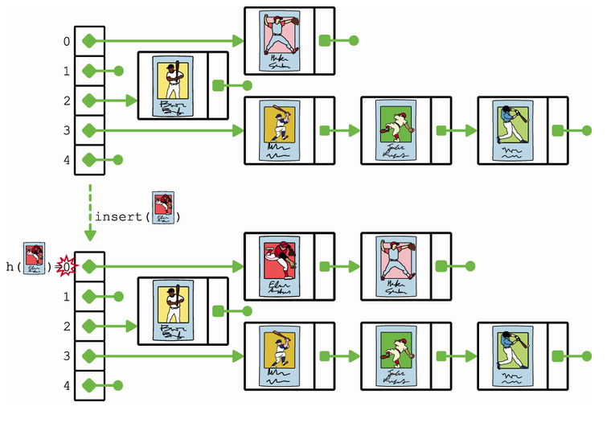
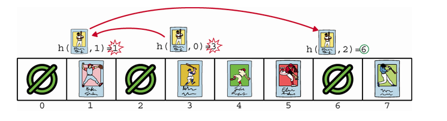

# Dictories and Hash Tables

A `dictionary` is a data structure that stores `key-value` pairs. It's like a list, but instead of storing elements in a sequence, a dictionary stores key-value pairs. The key is used to look up the associated value.

**The performance of a dictionary depends on its implementation.**

To create a dictionary we need to implement 3 methods:

- Insert: Add a key-value pair to the dictionary.
- Delete: Remove a key-value pair from the dictionary.
- Lookup: Find the value associated with a key.



Implementation of dictionary -> a BBST has the best performance for all 3 methods.



## Hash Tables

To implement a dictionary, we can use a hash table. A hash table is a data structure that maps keys to values. It uses a hash function to compute an index into an array of buckets or slots, from which the desired value can be found.




## Hash Functions

A `hash function` is a function that takes an input (or "key") and returns a fixed-size string of bytes. The output is typically a number that represents the position in the hash table.

- The domain of a hash function must be the set of all possible keys. Of course, the possible values for the input depend on the context. But we can always convert the elements to be stored to integers, so we can say that the domain for a general-purpose hash function is the set of all integers.

- A hash function must return a valid index. If our hash table has size `m`, then the output of the hash function associated with the table must be an integer between `0` and `m-1`.



Example of a hash function:

```python
h = lambda k: math.floor(m * ((A * k) % 1))
```

## Collision Resolution

In a `hash-table` at some point, we will have two keys that hash to the same index. This is called a `collision`. There are several ways to resolve collisions:

- **Separate Chaining**: The first way we can resolve a conflict is by allowing multiple items to be stored in the same cell. Of course, we can’t make an array cell larger and store more than one value in it. So, we need to be creative. Instead of storing values directly in the array’s cells, each cell stores the head of a linked list, called a `hash chain`. When a new element x is hashed into the i-th cell, we retrieve the hash chain pointed to by that cell and insert x at its front. If we want to avoid duplicates, we can instead add new elements to the tail of the list, after traversing the entire list and checking that x is not there



```python
class HashTable:
    __A__ = Decimal((sqrt(5) - 1) / 2)
    def __init__(self, buckets, extract_key=hash):
        self._m = buckets
        self._data = [SinglyLinkedList() for _ in range(buckets)]
        self._extract_key = extract_key
    def _hash(self, key):
        return floor(self._m*((Decimal(key) * HashTable.__A__)%1))

    def insert(self, value):
        index = self._hash(self._extract_key(value))
        self._data[index].insert_in_front(value)
    def _search(self, value):
        index = self._hash(key)
        value_matches_key = lambda v: self._extract_key(v) == key
        return self._data[index].search(value_matches_key)
```

- **Open Addressing**: In open addressing, for each key, we can probe all m array cells, in some order, until we either find what we were looking for (an element or an empty cell), or we probed all cells. In a way, after a conflict we get a retry, a second chance (and a third chance, and so on). Search works similarly, with one important caveat: the moment we are hashed to an empty cell, we know the search is unsuccessful. Otherwise, we check the value we found, and if it matches the target of the search, we are successful. Otherwise, we know we need to try again.



Two popular open addressing schemes are:

- **Linear Probing**: In linear probing, we probe the cells in a linear order, starting from the cell where the key was hashed. If we reach the end of the array, we wrap around and continue probing from the beginning. `p(k,i) = (h(k) + i) % m`

- **Quadratic Probing**: In quadratic probing, we probe the cells in a quadratic order, starting from the cell where the key was hashed. `p(k,i) = (h(k) + a*i + b*i2) % m`

Compared to chaining, open addressing has one main advantage—you don’t waste memory for the linked lists, and you need only minimal overhead for the array.

## Recap

- The dictionary is an abstract data type for a container that stores elements that can later be searched (or deleted) by key. Dictionaries are used everywhere, from routers to key-value databases.

- We can use several of the data structures discussed in this book to implement a dictionary ADT, but balanced binary search trees are the ones that guarantee the best performance over all operations.

- An implementation using hash tables offers the best average performance for insert, search, and delete.

- A direct-access table is an array where each key (integer element) k is stored at index k, making search-by-value as fast as constant time. Non-integer elements are first converted to integers by extracting a unique ID. Direct-access tables are impractically large.

- A hash table is a special version of an array, where the index of an (integer) element is returned by a special function called a hash function. Hash tables can be much smaller than the range of values stored, making them more practical than direct-access tables.

- Since the range of keys of a hash table can be larger than the number of cells in the table, we can’t avoid conflicts, that is, two keys mapping to the same array cell.

- Conflicts can be resolved through chaining or open addressing.

- In chaining, each table cell references a linked list where the elements are stored. These tables can grow indefinitely.

- In open addressing, a different permutation of the table’s indexes corresponds to each key. If on insert we find that the first index is already taken, then we try the second one, and so on—similarly with search.

- Hash tables with open addressing can’t store more elements than the number of cells. They make deleting elements complicated, and their performance degrades with the filling ratio. Thus, they are rarely used.

- The average running time of insertion, search, and deletion for hash tables is constant time. The worst-case performance, however, is linear time.

- If the hash function used is deterministic or easily guessed by an attacker, it is possible to design a sequence of keys that will cause the hash table to perform very poorly. This originated a vulnerability in servers written in several programming languages, including Perl, PHP, Python, Ruby, Java, and JavaScript.
