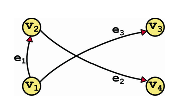
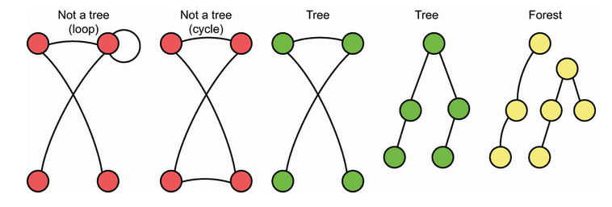
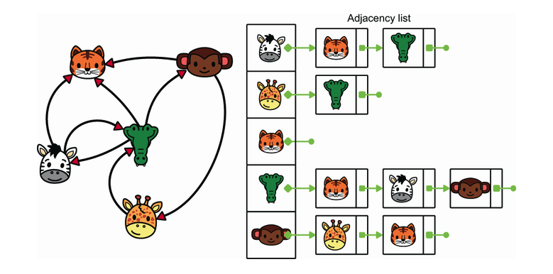
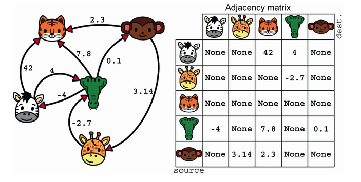

# Graphs

A `graph` is a generalization of `trees`. A more formal definition would be:

We can define a graph `G` as a pair of sets. A ser of vertices `V` and a set of edges `E`. Each edge is a pair `(v, w)` where `v, w` are elements of `V`.



`G = (V, E) = ({v1, v2, v3, ...}, {(v1, v2), (v2, v3), ...})`

- An edge whose source and destination are the same is called a loop.

- Simple graphs are graphs without loops, with at most one edge between any two vertices. For any couple of vertices u,v, where u ≠ v, there can only be (at most) one edge from u to v.

- Multigraphs, in contrast, can have any number of edges between two given vertices. Both simple graphs and multigraphs can be extended to allow loops.

- An edge can have a numerical value associated with it. Such a value is called its weight, and the edge is then called a weighted edge.

- A graph is sparse if the number of edges is relatively small. For reference, we can consider a graph with n vertices to be sparse if its number of edges is O(n) or less.

- A graph is dense if the number of edges is close to the maximum possible, which can be at most O(n2) for a simple graph with n vertices.

- We can have `directed graphs`. In a directed graph, edges have a direction: they only go from the source vertex to the destination vertex. In an undirected graph, edges have no direction: they simply connect two vertices.

## Trees vs Graphs

A tree is, in fact, a simple, undirected, connected, and acyclic graph. As such, a tree with n vertices (nodes, in tree terms) must have exactly n-1 edges.



## Implementation

There are two basic ways of implementing a graph: the `adjacency matrix` and the `adjacency list`.

- Adjacency List: In the adjacency list representation, we group edges by their source vertex. Given a vertex `v`, the list of all edges with `v` as their source is the adjacency list for `v`. We then build a dictionary in which we associate each vertex in the graph with its adjacency list.



```python
class Vertex:
  def __init__(self, key):
    self.id = key
    self._adj_list = SinglyLinkedList()

  def has_edge_to(self, destination_vertex):
        return self._adj_list._search(destination_vertex) is not None

  def add_edge_to(self, destination_vertex):
        if self.has_edge_to(destination_vertex):
            raise ValueError(f'Edge already exists: {self} -> { destination_vertex}')
        self._adj_list.insert_in_front(destination_vertex)

class Graph:
    def __init__(self):
        self._adj = {}

    def _get_vertex(self, key):
      if key not in self._adj:
          raise ValueError(f'Vertex {key} does not exist!')
      return self._adj[key]

    def insert_vertex(self, key):
      if key in self._adj:
          raise ValueError(f'Vertex {key} already exists!')
      self._adj[key] = Graph.Vertex(key)

    def insert_edge(self, key1, key2):
      v1 = self._get_vertex(key1)
      v2 = self._get_vertex(key2)
      v1.add_edge_to(v2)

    def delete_vertex(self, key):
      v = self._get_vertex(key)
      for u in self._adj.values():
          if u != v and u.has_edge_to(v):
              u.remove_edge_to(v)
      del self._adj[key]
```

- Adjacency Matrix: In the `adjacency matrix` representation, we store the edges in a large matrix whose rows and columns are the vertices of the graph. A cell of the matrix with coordinates (u,v) can store a binary value (0 if there is no edge; 1 if there is an edge from u to v), the weight of the edge (or a special value such as None if there is no edge), or an object that models an edge.

`Adjacency matrices` can be faster than `adjacency lists` when we need to check whether there is an edge between two vertices: it takes only a single lookup in a 2D array, which is O(1). Thus, `adjacency matrices` give us an advantage for algorithms that require intensive connectivity checking.

In contrast, an adjacency matrix requires memory proportional to the square of the number of vertices (that is, the maximum number of edges in a simple graph), even if the graph is sparse.



**Use adjacency lists when the graph is sparse and adjacency matrices when the graph is dense.**

## Graph Search
