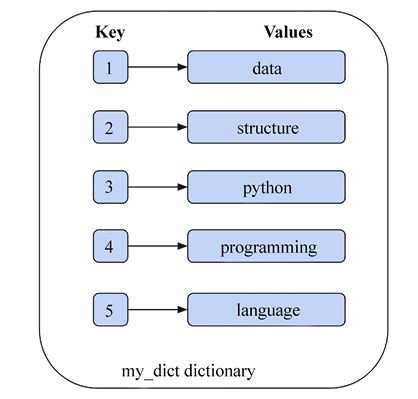
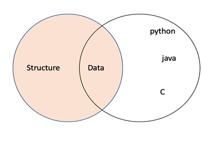

# Python Data Types and Structures

Python is an interpreted language: the statements are executed line by line. It follows the concepts of object-oriented programming. Python is dynamically typed, which makes it an ideal candidate among languages for scripting and fast-paced development on many platforms. Its source code is open source, and there is a very big community that is using and developing it continuously, at a very fast pace. Python code can be written in any text editor and saved with the .py file extension. Python is easy to use and learn because of its compactness and elegant syntax.

## Python Data Types

An `algorithm` is a step-by-step procedure for solving a problem. It is a sequence of instructions that can be followed to achieve a specific goal. Algorithms are used in computer science to solve problems and perform tasks. The performance or efficiency of an algorithm depends highly on how the data is stored in the computer.
The data to be used in an algorithm has to be stored in variables, which differ depending upon what kind of values are going to be stored in those variables. These are called `data types`.

```python
p = "Hello India"
q = 10
r = 10.2
print(type(p)) # <class 'str'>
print(type(q)) # <class 'int'>
print(type(r)) # <class 'float'>
print(type(12+31j)) # <class 'complex'>
```

## Basic Data Types

The most basic data types in Python are numeric and boolean types.

```python
a = 10
b = 20.5
c = 1 + 2j
d = True
e = False
print(type(a)) # <class 'int'>
print(type(b)) # <class 'float'>
print(type(c)) # <class 'complex'>
print(type(d)) # <class 'bool'>
print(type(e)) # <class 'bool'>
```

`Sequences` data types are also a very basic and common data type. These are used to store a collection of items. The most common sequence data types are `list`, `tuple`, and `string`. These data types are used to store a collection of items in a single variable. The items in these data types can be of different data types.

These data types are `inmutable`, which means that once they are created, they cannot be changed. The items in these data types can be accessed using indexing. The indexing starts from 0. The items in these data types can be of different data types. (Even though the items in these data types can be of different data types, it is recommended to use the same data type for all the items in these data types. This is because it makes the code more readable and easier to understand. Also these data types in Python are mutable but, in the case of `tuples`, they are immutable. This means that once they are created, they cannot be changed. Tuples are used instead of lists when we wish to store the data that should not be changed in the program)

## Operators

Python supports `membership`, `identity`, and `logical operators`. Several data types in Python support them

```python
# Membership Operators: Check if a value is present in a sequence
a = [1, 2, 3, 4, 5]
print(1 in a) # True
# in, not in
print(6 in a) # False
print(6 not in a) # True
# Identity Operators: Check if two variables point to the same object
a = [1, 2, 3]
b = a
print(a is b) # True
print(a is not b) # False
# Logical Operators: Combine boolean values
a = True
b = False
print(a and b) # False
print(a or b) # True
print(not a) # False
```

## Complex Data Types

### Dictionaries

Dictionaries are used to store data values in `key:value pairs`. A dictionary is a collection which is unordered, changeable and does not allow duplicates. Dictionaries are written with curly brackets, and they have keys and values. The `key` must be of a hashable and immutable data type. The values can be of any data type. In this context, an object is hashable if it has a hash value that does not change during its lifetime in the program

```python
dict = {
    <key>: <value>,
    <key>: <value>,
      .
      .
      .
    <key>: <value>
}
```



## Sets

A `set` is an unordered collection of hashable objects. It is iterable, mutable, and has unique elements. Sets support membership testing operators (in, not in), and operations such as intersection, union, difference, and symmetric difference.

```python
x1 = set(['and', 'python', 'data', 'structure'])
print(x1)
print(type(x1))
x2 = {'and', 'python', 'data', 'structure'}
print(x2)
```


