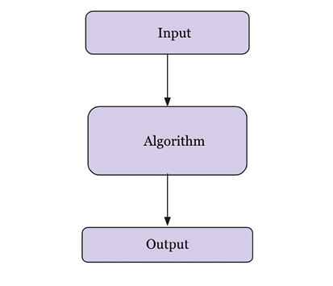

# Algorithm Design

An `algorithm` is a sequence of steps that should be followed in order to complete a given task/problem.

To solve a given problem we need to consider two ky aspects:

- Find an efficient mechanism to store, manage, and retrieve data, which is required to solve the problem. This comes under `data structures`.
- Find an efficient way to manipulate the data in order to solve the problem. This comes under `algorithms`.

The costs of executing different algorithms may be different; it may be measured in terms of the `time` required to run the algorithm on a computer system and the `memory` space required for it. Performance analysis of the algorithm is very important for deciding the best solution for a given problem. The performance of an algorithm is measured in terms of `time complexity` and `space complexity`.

## Performance Analysis of an Algorithm

The performance of an algorithm is generally measured by the size of its input data, and the time and the memory space used by the algorithm.

### Time Complexity

The time complexity of the algorithm is the amount of time that an algorithm will take to execute on a computer system to produce the output. The running time required by an algorithm depends on the input size; as the input size, `n`, increases, the runtime also increases.

Example: Linear Search. [Code here](./linear_search.py)

The `worst-case running time` of the algorithm is the upper-bound complexity; it is the maximum runtime required for an algorithm to execute for any given input. For example, in the linear search problem, the worst case occurs when the element to be searched is found in the last comparison or not found in the list at all. In this case, the algorithm will have to check all the elements in the list before concluding that the element is not present in the list. The worst-case running time of the linear search algorithm is `O(n)`. In this case, the running time required will linearly depend upon the length of the list, whereas, in the best case, the search element will be found in the first comparison.

The `average-case running time` is the average running time required for an algorithm to execute. In this analysis, we compute the average over the running time for all possible input values. Generally, probabilistic analysis is used to analyze the average-case running time of an algorithm, which is computed by averaging the cost over the distribution of all the possible inputs.

**_ In most real-world applications, worst-case analysis is mostly used, since it gives a guarantee that the running time will not take any longer than the worst-case running time of the algorithm for any input value._**

`Best-case running time` is the minimum time needed for an algorithm to run; it is the lower bound on the running time required for an algorithm.
