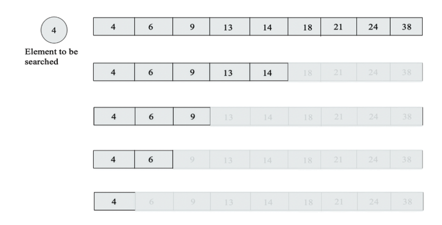
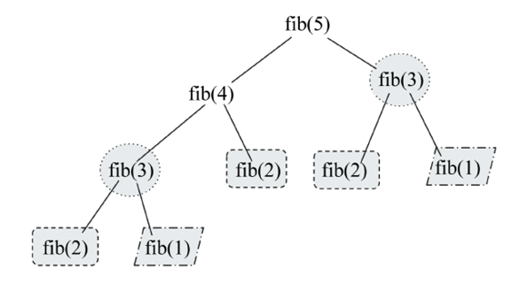

# Algorithm Design Techniques and Strategies

Algorithm design techniques are strategies or methods used to develop algorithms for solving computational problems. These techniques help in breaking down complex problems into manageable parts and provide a systematic approach to finding solutions. Here are some common algorithm design techniques:

1. **Brute Force**: This is the simplest approach where all possible solutions are generated and checked to find the best one. It is often not efficient but can be used as a baseline.
2. **Greedy Algorithms**: This technique builds up a solution piece by piece, always choosing the next piece that offers the most immediate benefit. It does not always lead to the optimal solution but is often efficient and easy to implement.
3. **Divide and Conquer**: This technique divides the problem into smaller subproblems, solves each subproblem independently, and then combines the solutions to solve the original problem. It is often used in sorting algorithms like Merge Sort and Quick Sort.
4. **Dynamic Programming**: This technique is used for optimization problems where the solution can be constructed from solutions to smaller subproblems. It stores the results of subproblems to avoid redundant calculations.
5. **Backtracking**: This technique is used for constraint satisfaction problems. It builds a solution incrementally and abandons a solution as soon as it determines that it cannot be extended to a valid solution.
6. **Recursion**: This technique involves solving a problem by solving smaller instances of the same problem. It is often used in conjunction with other techniques like divide and conquer or dynamic programming.

# Recursion

A recursive algorithm calls itself repeatedly in order to solve the problem until a certain condition is fulfilled. A `recursive function` should have two types of cases:

- **Base Case**: The simplest instance of the problem, which can be solved directly without further recursion. Recursion will be stopped once the base case is met.
- **Recursive Case**: The part of the function that breaks the problem down into smaller subproblems and calls itself to solve those subproblems.

Example: [Factorial Calculation](./factorial.py)

# Divide and Conquer

The `divide-and-conquer` paradigm divides a problem into smaller sub-problems, and then solves these; finally, it combines the results to obtain a global, optimal solution. Some examples of divide-and-conquer algorithms include:

- Binary search
- Merge sort
- Quick sort
- Algorithm for fast multiplication
- Strassen’s matrix multiplication
- Closest pair of points

## Binary Search

The binary search algorithm is based on the divide-and-conquer design technique. This algorithm is used to find a given element from a sorted list of elements. It first compares the search element with the middle element of the list; if the search element is smaller than the middle element, then the half of the list of elements greater than the middle element is discarded; the process repeats recursively until the search element is found or we reach the end of the list



The worst-case time complexity of the binary search algorithm is `O(log n)`.

## Merge Sort

Merge sort is an algorithm for sorting a list of n natural numbers in increasing order. Firstly, the given list of elements is divided iteratively into equal parts until each sublist contains one element, and then these sublist are combined to create a new list in a sorted order. The merge sort algorithm is based on the divide-and-conquer design technique. The worst-case time complexity of the merge sort algorithm is `O(n log n)`.

Code here: [Merge Sort](./merge_sort.py)

## Dynamic Programming

Dynamic programming is a method for solving complex problems by breaking them down into simpler subproblems. It is applicable when the problem can be divided into overlapping subproblems that can be solved independently. Dynamic programming uses memoization or tabulation to store the results of subproblems to avoid redundant calculations.
One property that makes a problem an ideal candidate for being solved with dynamic programming is that it has an `overlapping set of sub-problems`.

```python
def fibonacci(n):
    if n <= 1:
        return n
    return fibonacci(n - 1) + fibonacci(n - 2)

for i in range(5):
    print(fibonacci(i))
```

We have overlapping subproblems in the above code, as the same Fibonacci numbers are calculated multiple times. This can be optimized using dynamic programming.



```python
memo = {}

def fibonacci(n):
  if memo.get(n, None) is not None:
    return memo[n]
  if n == 1:
    return 1
  if n == 0:
    return 0

  memo[n] = fibonacci(n - 1) + fibonacci(n - 2)

  return memo[n]
```

## Greedy Algorithms

In greedy algorithms, the objective is to obtain the optimum solution from many possible solutions in each step. We try to get the local optimum solution, which may eventually lead us to obtain the global optimum solution. The greedy strategy does not always produce the optimal solution. However, the sequence of locally optimal solutions generally approximates the globally optimal solution
