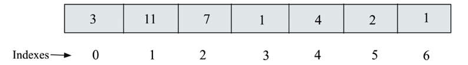

# Arrays

An `array` is a collection od data items of the same type. In Python we can use the built-in `list` type to represent an array. Arrays are used to store multiple values in a single variable, instead of declaring separate variables for each value.
An array stores the data of the same data type and each data element in the array is stored in contiguous memory locations.
Storing multiple data values of the same type makes it easier and faster to compute the position of any element in the array using `offset` and `base address`.

- Base address is the address of the first element in the array.
- Offset is the distance from the base address to the address of the element we want to access.



In an array, elements can be acccesed randomly using their index. The index of the first element is 0, the second element is 1, and so on. This allows for efficient access to elements in the array. The array data structure has further limitations in that it has a static size that has to be declared at the time of creation. In addition, the insertion and deletion operations in array data structures are slow as compared to linked lists. This is because it is difficult to insert an element in an array at a given location since all data elements after that desired position must be shifted and then new elements inserted in between

# Linked Lists

In a `linked list`, each element is a separate object, called a `node`, that contains a value and a reference (or link) to the next node in the sequence. This allows for efficient insertion and deletion of elements, as nodes can be easily added or removed without needing to shift other elements. The last element in a linked list points to `None`, indicating the end of the list. Contrary to arrays, linked lists store data items sequentially in different locations in memory, wherein each data item is stored separately and linked to other data items using pointers


```python
class Node:
    def __init__(self, data):
        self.data = data
        self.next = None
```

## Singly Linked List

A `singly linked list` contains a number of nodes in which each node contains data and a pointer that links to the next node. The link of the last node in the list is `None`, which indicates the end of the list.


To create singly linked list, we can we the `Node` class defined above, and then link the nodes together by setting the `next` attribute of each node to point to the next node in the list.

```python
head = Node(1)
second = Node(2)
third = Node(3)

head.next = second
second.next = third
```

Traversal of the linked lists means visiting all the nodes of the list, from the starting node to the last node. The process of traversing the singly linked list begins with the first node, displaying the data of the current node, following the pointers, and finally stopping when we reach the last node.
