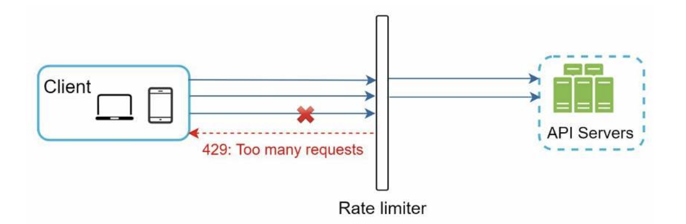
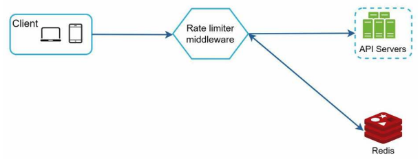
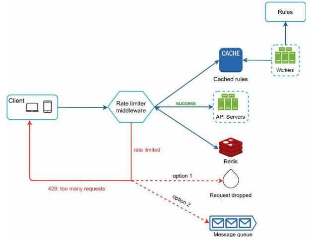

# Design a Rate Limiter

A rate limiter is a system that controls the rate of incoming requests to a service or API. It helps prevent abuse, ensures fair usage, and protects the service from being overwhelmed by too many requests in a short period of time.

1. Understand the problem and establish a design scope

- What kind of rate limiter do we need?: We're designing a rate limiter on the server side
- What kind of throttling do we need?: We need to support different types of throttling.
- At what scale do we need to operate?: We need to support a large number of users and requests.
- Will the system work in a distributed environment?: Yes, the system will work in a distributed environment.
- Is the rate limiter a separated service or a library?: Up to you, but a separated service is more flexible.
- Do we need to inform users when they are being rate limited?: Yes, we need to inform users when they are being rate limited.

Additional requirements:

- Accurately limit excessive requests.
- Low latency.
- Use as little memory as possible.
- Distributed system support.
- Exception handling (show appropriate error messages).
- High fault tolerance.

2. Propose a high-level design

We need to implement the limiter on the server side. We create a Rate Limiter middleware that will intercept incoming requests and check if the user has exceeded their allowed request rate. If they have, we return an error response. If not, we allow the request to proceed.



Usually rate limiting is implemented within a component called API Gateway. The API Gateway is the entry point for all incoming requests to the service. It is responsible for routing requests to the appropriate service, as well as handling authentication, authorization, and rate limiting.

# Algorithms for rate limiting

Identify the best algorithm for rate limiting. This depends on the specific requirements of the system. Some common algorithms include:

- Token Bucket
- Leaky Bucket
- Fixed Window
- Sliding Window Log
- Sliding Window Counter

**Token Bucket**

The Token Bucket algorithm is a popular rate limiting algorithm that allows for bursts of traffic while maintaining a steady average rate. It works by maintaining a "bucket" of tokens, where each token represents the ability to make a request. Tokens are added to the bucket at a fixed rate, and when a request is made, a token is removed from the bucket. If there are no tokens available, the request is denied. One request consumes one token, when a request is made, a token is removed from the bucket. If there are no tokens available, the request is denied.
To implement the algorithm, we need to define the following parameters:

- Token generation rate (r): The rate at which tokens are added to the bucket (e.g., 5 tokens per second).
- Bucket capacity (b): The maximum number of tokens that can be stored in the bucket (e.g., 10 tokens).

```typescript
// token-bucket.ts
export class TokenBucket {
	/** max tokens the bucket can hold (burst capacity) */
	private readonly capacity: number;
	/** tokens refilled per second */
	private readonly refillPerSecond: number;

	private tokens: number;
	private lastRefillSec: number;
	private nowSec = () => Date.now() / 1000; // swap in tests

	constructor(opts: {
		capacity: number; // e.g., 100
		refillPerSecond: number; // e.g., 100/60 for "100 per minute"
		nowSecProvider?: () => number;
		initialTokens?: number; // default: capacity (start “full”)
	}) {
		if (opts.capacity <= 0) throw new Error('capacity must be > 0');

		if (opts.refillPerSecond < 0)
			throw new Error('refillPerSecond must be >= 0');

		this.capacity = opts.capacity;
		this.refillPerSecond = opts.refillPerSecond;
		this.tokens = Math.min(opts.initialTokens ?? opts.capacity, opts.capacity);

		if (opts.nowSecProvider) this.nowSec = opts.nowSecProvider;

		this.lastRefillSec = this.nowSec();
	}

	/** Refill tokens based on elapsed time */
	private refill() {
		const now = this.nowSec();
		const elapsed = Math.max(0, now - this.lastRefillSec);
		if (elapsed > 0) {
			this.tokens = Math.min(
				this.capacity,
				this.tokens + elapsed * this.refillPerSecond
			);
			this.lastRefillSec = now;
		}
	}

	/**
	 * Try to consume `n` tokens (default 1).
	 * Returns { allowed, remaining, retryAfterSec }.
	 */
	consume(n = 1): {
		allowed: boolean;
		remaining: number;
		retryAfterSec?: number;
	} {
		if (n <= 0) return { allowed: true, remaining: Math.floor(this.tokens) };

		this.refill();

		if (this.tokens >= n) {
			this.tokens -= n;
			return { allowed: true, remaining: Math.floor(this.tokens) };
		}

		// Not enough tokens — compute time until next token(s)
		const need = n - this.tokens;
		const retryAfterSec =
			this.refillPerSecond > 0
				? need / this.refillPerSecond
				: Number.POSITIVE_INFINITY;

		return {
			allowed: false,
			remaining: Math.floor(this.tokens),
			retryAfterSec,
		};
	}
}
```

**Leaky Bucket**
The Leaky Bucket algorithm is another popular rate limiting algorithm that is similar to the Token Bucket algorithm. It works by maintaining a "bucket" that leaks at a fixed rate. When a request is made, it is added to the bucket. If the bucket is full, the request is denied. The bucket leaks at a fixed rate, allowing for a steady flow of requests over time.
This is usually implemented using a queue data structure. When a request is made, it is added to the queue. If the queue is full, the request is denied. The queue is processed at a fixed rate, allowing for a steady flow of requests over time.

To implement the leaking bucket algorithm, we need to define the following parameters:

- Leak rate (r): The rate at which requests are processed (e.g., 5 requests per second).
- Bucket capacity (b): The maximum number of requests that can be stored in the bucket (e.g., 10 requests).

```typescript
// leaky-bucket-shaper.ts
export type QueueLike<T> = {
	enqueue(item: T): void;
	dequeue(): T | undefined;
	size(): number;
	isEmpty(): boolean;
};

type Pending = { resolve: () => void; reject: (e: any) => void };

export class LeakyBucketShaper {
	private readonly capacity: number;
	private readonly dripIntervalMs: number;
	private readonly queue: QueueLike<Pending>;

	private timer: NodeJS.Timeout | null = null;
	private running = false;

	constructor(opts: {
		capacity: number; // max queued items
		leakPerSecond: number; // steady rate (items/sec)
		queue: QueueLike<Pending>;
	}) {
		if (opts.capacity <= 0) throw new Error('capacity must be > 0');
		if (opts.leakPerSecond <= 0) throw new Error('leakPerSecond must be > 0');
		this.capacity = opts.capacity;
		this.dripIntervalMs = 1000 / opts.leakPerSecond;
		this.queue = opts.queue;
	}

	/** Start leaking at a constant rate */
	start() {
		if (this.running) return;
		this.running = true;
		this.scheduleNext();
	}

	/** Stop leaking */
	stop() {
		this.running = false;
		if (this.timer) {
			clearTimeout(this.timer);
			this.timer = null;
		}
	}

	/** Enqueue a unit of work; resolves when it's released (your code runs then). Rejects if queue is full. */
	acquire(): Promise<void> {
		if (this.queue.size() >= this.capacity) {
			return Promise.reject(new Error('LeakyBucket full'));
		}
		return new Promise<void>((resolve, reject) => {
			this.queue.enqueue({ resolve, reject });
			// Ensure pump is active
			this.start();
		});
	}

	private scheduleNext() {
		if (!this.running) return;
		// If queue is empty, pause until something arrives
		if (this.queue.isEmpty()) {
			// Avoid busy timers when idle
			this.timer = setTimeout(() => this.scheduleNext(), this.dripIntervalMs);
			return;
		}

		// Release exactly one item, then schedule next drip
		const pending = this.queue.dequeue();
		if (pending) {
			try {
				pending.resolve();
			} catch (e) {
				pending.reject?.(e);
			}
		}
		this.timer = setTimeout(() => this.scheduleNext(), this.dripIntervalMs);
	}
}
```

**Fixed Window Counter**
The Fixed Window Counter algorithm is a simple rate limiting algorithm that divides time into fixed windows (e.g., 1 minute) and counts the number of requests made in each window. If the number of requests exceeds a predefined limit, subsequent requests are denied until the next window begins.
This algorithm is easy to implement and understand, but it can lead to bursts of traffic at the beginning of each window.

**Sliding Window Log**
The Sliding Window Log algorithm is a more advanced rate limiting algorithm that maintains a log of timestamps for each request. When a new request is made, the algorithm checks the log to see how many requests have been made in the past time window (e.g., 1 minute). If the number of requests exceeds a predefined limit, the request is denied. Otherwise, the request is allowed, and the timestamp is added to the log.
This algorithm provides a more accurate representation of the request rate over time, but it requires more memory to store the log of timestamps.

**Sliding Window Counter**

The Sliding Window Counter algorithm is a hybrid approach that combines elements of both the Fixed Window Counter and Sliding Window Log algorithms. It divides time into fixed windows (e.g., 1 minute) and maintains a count of requests made in each window. When a new request is made, the algorithm checks the counts of the current and previous windows to determine if the request should be allowed or denied. If the combined count exceeds a predefined limit, the request is denied. Otherwise, the request is allowed, and the count for the current window is incremented.
This algorithm provides a balance between accuracy and memory usage, making it suitable for many applications.

3. High-level Architecture

At a high level, the rate limiter is a counter that keeps track of how many requests have been made by each user in a given time period. When a request is made, the rate limiter checks the counter to see if the user has exceeded their allowed request rate. If they have, the request is denied. If not, the request is allowed, and the counter is incremented.

The counter should be implemented using an in-memory cache like Redis because it provides fast access times and can handle a large number of requests. Each user will have their own counter, which will be stored in the cache with a key that includes the user's ID and the time period (e.g., minute, hour).



- Limiting Rules: should be written in configuration files and saved in memory. (.using JSON or YAML format).
- When the limit is reach we should respond with HTTP 429 Too Many Requests status code.

4. Detailed Design



While implementing the rate limiter, we need to consider the following:

- Concurrency: We need to ensure that the rate limiter can handle concurrent requests from multiple users. This can be achieved by using atomic operations in Redis or by using distributed locks (even though they can add latency).
- Synchronization: In a distributed system, we need to ensure that the rate limiter is synchronized across all instances of the service. This can be achieved by using a centralized cache like Redis.
