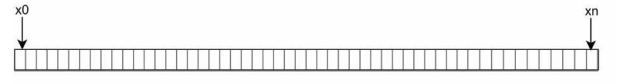
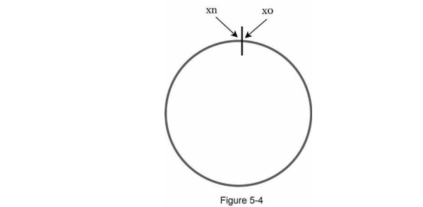
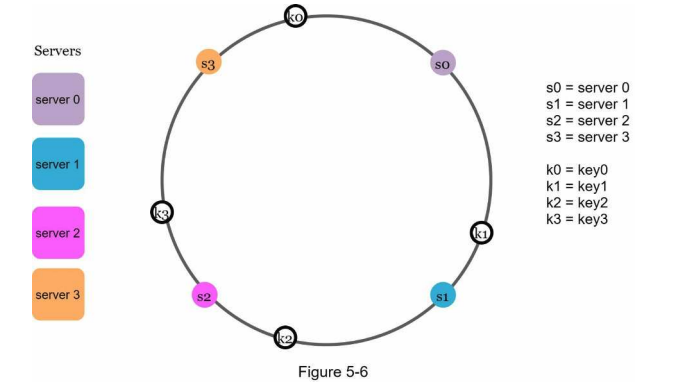

# Design Consistent Hashing

Consistent hashing is a technique used in distributed systems to accomplish horizontal scaling and to minimize the reorganization of data when nodes are added or removed from the system. It is particularly useful in scenarios where you have a large number of nodes (servers) and you want to distribute data (like cache entries, database records, etc.) evenly across these nodes.

## Key Concepts

1. **The problem with Hash Function**: A hash function takes an input (like a key or identifier) and produces a fixed-size string of bytes. In consistent hashing, both the nodes and the data items are hashed using the same hash function.

To assign an index to a node, we can use the following formula:

```typescript
index = hash(node_key) % number_of_nodes; // node_key could be the IP address or hostname of the node and number_of_nodes is the total count of nodes in the system
```

This formula works well when the number of nodes is static. However, in a distributed system where nodes can be added or removed dynamically, this approach can lead to significant data reorganization (remapping of keys to nodes) whenever the number of nodes changes. For example, if we have 4 nodes and we add a 5th node, all keys will need to be remapped because the modulus operation will yield different results.

2. **The solution**: Consistent Hashing is a special kind of hashing that minimizes the number of keys that need to be remapped when a node is added or removed. We need to remap only a small fraction of the keys, rather than all keys. Here we just need to remap the keys that were assigned to the node that is being removed or the new node that is being added. (k/n keys where k is the total number of keys and n is the total number of nodes).

### How Consistent Hashing Works - Hash Ring

As example we'll use SHA-1 as the hash function. We the following range of values: 0 to 2^160 - 1 (since SHA-1 produces a 160-bit hash).



If we join the two ends of the range, we get a circular space known as a hash ring. Both nodes and data items are mapped to points on this ring using the hash function.



Then we can map servers to points on the ring using the hash function. To determine which server is responsible for a given data item, we hash the data item's key to get a point on the ring and then move clockwise until we find the first server.



Now when servers are added or removed, only a small number of data items need to be remapped. For example, if we add a new server, it will take over responsibility for the data items that fall between its position on the ring and the next server in the clockwise direction.
